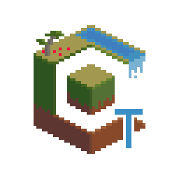

[discord]:https://discord.gg/kBMEmDD
[twitter]:https://twitter.com/Compliance32x
[wiki]:https://github.com/Compliance-Resource-Pack/ComplianceTweaksServer/wiki

<h1 align="center">
     
    
     
    Compliance Tweaks Server
     
</h1>

The server for an open source recreation of <a href="https://vanillatweaks.net/picker/resource-packs/">Vanilla Tweaks</a> built for the Compliance x32 Texturepack by <a href="https://compliancepack.net/">The Compliance Team</a>.

    
    
    
    
    
    

# Deployment and Testing
## Assets and Config
In order to run your server you need to have an `assets` folder (the folder name can be changed with an environment variable). This assets folder will contain both the configuration/location for each of your modules in the `assets/config` folder as well as the images for these modules in the `assets/config` folder. If you would like an example, please check out the official [Compliance Tweaks Java x32 Assets Folder](https://github.com/Compliance-Resource-Pack/ComplianceTweaks-Java-x32).

### Environment Variables
For more server configuration check out the environment variables in [example.env](example.env).

## Deploying the server
There are a few ways to deploy the server. It's really just an Express server written in TypeScript. The easiest way to deploy the server would be to use docker. For instructions on how to do so, check out [DOCKER.md](DOCKER.md).

## Testing the server locally
To test the server locally just run `npm i` and then `npm run dev`. Dotenv is installed, so if you would like to change any environment variables, just use a `.env` file in the root of the project.

# Get Tn Touch
- 💬 Come visit us on [Discord][discord]
- ❗️ Create [an issue](https://github.com/Compliance-Resource-Pack/ComplianceTweaksServer/issues/new)
- 🦜 Check us out on [Twitter][twitter]

# Contributing
Before contributing please read [CONTRIBUTING.md](CONTRIBUTING.md).

# Credits
## People involved
- [Banakin](https://banakin.dev/) - Making the server
- [The Compliance Team](https://compliancepack.net/) - Making the Compliance Texture Pack
- [Vanilla Tweaks](https://vanillatweaks.net/picker/resource-packs/) - Inspiration

## Tech Used
- [Docker](https://www.docker.com/) - Containerizing and deploying the server
- [node.js](https://nodejs.org/) - Running the JavaScript server
- [Express](https://expressjs.com/) - Framework for the API
- [Canvas](https://github.com/Automattic/node-canvas) - Combining images
- [Archiver](https://github.com/archiverjs/node-archiver) - Creating the ZIP file