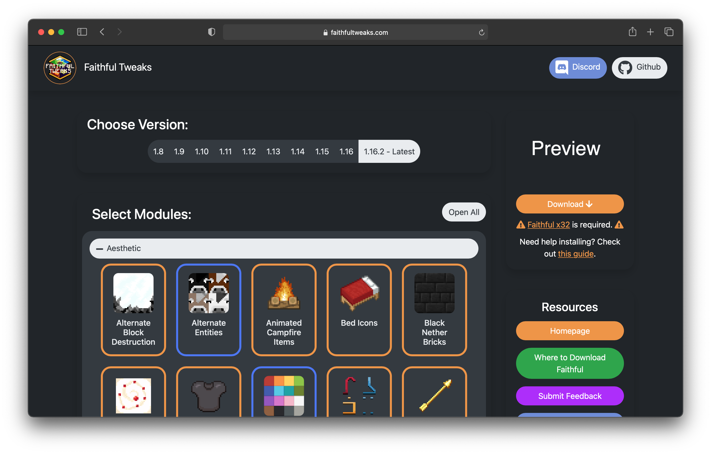

[discord]:https://discord.gg/kBMEmDD
[twitter]:https://twitter.com/Compliance32x
[wiki]:https://github.com/Compliance-Resource-Pack/ComplianceTweaksServer/wiki

<h1 align="center">
     
    
     
    Compliance Tweaks Server
     
</h1>

The server for an open source recreation of <a href="https://vanillatweaks.net/picker/resource-packs/">Vanilla Tweaks</a> built for the Compliance x32 Texturepack by <a href="https://compliancepack.net/">The Compliance Team</a>.

    
    
    
    
    
    

</img>

## Get Tn Touch
- 💬 Come visit us on [Discord][discord]
- ❗️ Create [an issue](https://github.com/Compliance-Resource-Pack/ComplianceTweaksServer/issues/new)
- 🦜 Check us out on [Twitter][twitter]

## Contributing
There are two different categories for contributions. To contribute please read [CONTRIBUTING.md](CONTRIBUTING.md).

## Documentation
For doumention on the project, please check out [the wiki][wiki].

## Credits
⚠ **NOTE** We try to give credit to those that created the textures but we're not great at keeping track. If you believe some textures are yours please contact us and we'll add you to this list (or take your textures down upon request).
- [Banakin](https://banakin.github.io): Making the website and various tweaks
- Doge: FullyAgedCropMarker and AlternateBlockDestruction
- [The Compliance Team](https://compliancepack.net/): Making the Compliance Texture Pack
- [Nekzuris](https://twitter.com/Nekzuris): ColoredPing
- Pomik108: RainbowXPBar
- Redcoke26: MelonHunger
- Seirin-Blu: Unobtrusive Rain, Unobtrusive Water
- TheRandomGamerTRG: Making the information site and various tweaks
- [Stridey](https://www.planetminecraft.com/member/stridey/): LowShield
- [Vanilla Tweaks](https://vanillatweaks.net/picker/resource-packs/): Inspiration
- [jogurciQ](https://www.planetminecraft.com/member/jogurciq/): Dark UI textures

## Tech Used
- [Firebase](https://firebase.google.com/) - Backend (API, Hosting, Storage)
- [node.js](https://nodejs.org/) - Used for the API
- [Canvas](https://github.com/Automattic/node-canvas) - Combining images
- [Archiver](https://github.com/archiverjs/node-archiver) - Creating the ZIP file
- [Hugo](https://gohugo.io/) - Website framework
- [Webpack](https://webpack.js.org/) - Bundler
- [Bootstrap](https://getbootstrap.com/) - CSS framework for the website
- [jQuery](https://jquery.com/) - JavaScript Framework for the website
- [Popper](https://popper.js.org/) - Engine for description popups
- [Font Awesome](https://fontawesome.com/) - Icons used on the website
